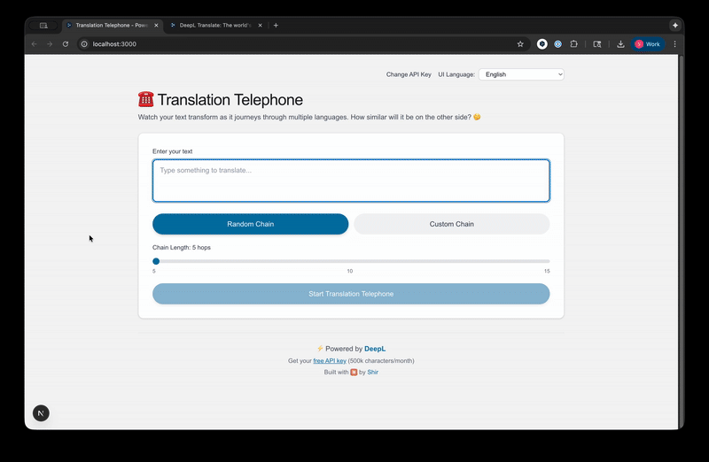

# Translation Telephone

☎️ Watch your text transform as it journeys through multiple languages. A demonstration of semantic drift using DeepL's translation API.



## Features

- **Random or Custom Language Chains**: Choose 5-15 translation hops
- **Real-time Progress**: Watch translations complete step-by-step with live updates
- **Divergence Graph**: Interactive chart showing semantic drift progression
- **Smart Divergence Scoring**: Focus on content words, ignore punctuation and stop words
- **Visual Diff**: Color-coded comparison of original vs final text
- **Multilingual UI**: Interface available in 30+ languages
- **Keyboard Shortcuts**: Cmd/Ctrl+Enter to submit

## Setup

### Prerequisites

- Node.js 18+ and npm
- A DeepL API key ([free tier](https://www.deepl.com/pro-api): 500k characters/month)

### Local Development

1. **Clone and install**
   ```bash
   cd translation-telephone
   npm install
   ```

2. **Configure API key**

   Get your free API key at https://www.deepl.com/pro-api

   Create `.env.local`:
   ```bash
   DEEPL_API_KEY=your_actual_api_key_here
   ```

3. **Run**
   ```bash
   npm run dev
   ```

   Open [http://localhost:3000](http://localhost:3000)

## Deployment to Vercel (Free!)

**This app is configured for user-provided API keys** - no server-side keys needed!

### Quick Deploy

[](https://vercel.com/new/clone?repository-url=https://github.com/yourusername/translation-telephone)

1. Click "Deploy" button above or visit [vercel.com](https://vercel.com)
2. Import your GitHub repository
3. Deploy! (No environment variables needed)
4. Each user enters their own DeepL API key when using the app

### How It Works

- Users enter their own DeepL API key when they first visit
- Keys are stored in browser localStorage (never sent to your server except for translations)
- Each user gets their own 500k characters/month free tier
- You pay nothing and have zero API costs!

### Alternative: Shared API Key (Not Recommended)

If you want to provide a single API key for all users:

1. Add `DEEPL_API_KEY` environment variable in Vercel dashboard
2. Modify the code to use server-side key as fallback
3. Be aware: 500k/month limit shared across ALL users

**Other Platforms**: Works on Netlify, Railway, or any Next.js host

## How Divergence is Calculated

The app uses a **content-focused word similarity algorithm** that ignores noise:

### Algorithm

1. **Back-translation**: After each hop, text is translated back to the original language
2. **Aggressive normalization**: Remove ALL punctuation (quotes, commas, colons, etc.)
3. **Stop word filtering**: Ignore common words like "the", "and", "a", "is" (50+ words)
4. **Content word extraction**: Keep only meaningful words > 2 characters
5. **Jaccard similarity**: Compare sets of content words
6. **Divergence**: `(1 - similarity) × 100`

### Why This Approach?

- **Ignores punctuation**: `"Hello, world!"` vs `"Hello world"` → 0% divergence
- **Ignores stop words**: `"The cat sat"` vs `"A cat sat"` → 0% divergence
- **Focuses on meaning**: `"Hello world"` vs `"Hello universe"` → 50% divergence

### Examples

| Original | Back-translation | Divergence | Why? |
|----------|-----------------|------------|------|
| `"The quick brown fox"` | `"A fast brown fox"` | **50%** | Only content words: "quick/fast", "brown", "fox" (1 of 2 differs) |
| `"Hello, world!"` | `"Hello world"` | **0%** | Punctuation ignored |
| `"I am happy"` | `"I'm joyful"` | **100%** | "happy" ≠ "joyful" (all content words differ) |

## Tech Stack

- **Framework**: Next.js 15 (App Router, Server-Sent Events)
- **Language**: TypeScript
- **Styling**: Tailwind CSS (DeepL-inspired design)
- **Translation**: DeepL API
- **Diff Algorithm**: `diff` library (visual), Jaccard similarity (scoring)

## License

MIT License

---

⚡ Powered by [DeepL](https://www.deepl.com) | 🤖 Built with Claude by [Shir](https://shirgoldberg.com)
